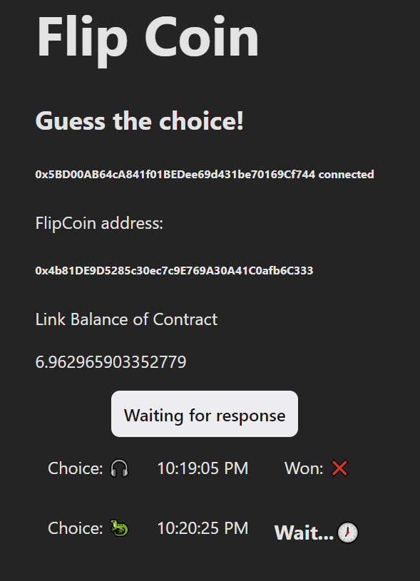

# Flip Coin

This is a simple program that flips a coin and tells you if it is heads or tails.

It's written in Solidity which is to be deployed on the Goerli network (values are hardcoded in the contract to match Goerli network configuration).

It uses Chainlink's VRFv2 with Direct Funding to generate a random number that is used to determine if the coin is heads or tails. Keep in mind that the contract that's deployed has to be funded with Link tokens in order to work.



## How to run

### Backend

1. Install dependencies

```bash
npm install
```

2. Provide your own `.env` file with the following variables:

```py
PRIVATE_KEY=abcdefabcdefabcdefabcdefabcdefabcdefabcdefabcdefabcdefabcdefabcdef
INFURA_PROJECT_ID=abcdefabcdefabcdefabcdefabcdef
```

3. Run the deploy script

```bash
npm run deploy

hardhat run scripts/deploy.js --network goerli
Compiled 1 Solidity file successfully
Address 0x5c63CC60C0Bda368b1FF15F7Fa35Ffb5A5d48EE9
```

### Frontend

4. Grab the address of the deployed contract and paste it into the `flipCoinAddress` variable in `frontend/src/App.js`

5. Grab the ABI of the deployed contract and paste it into the `abi` variable in `frontend/src/App.js` (In the case of the repo, the ABI is already provided in `frontend/src/abi/FlipCoinABI.json`).
6. Provide your own `.env` file with the following variables:

```py
INFURA_API_KEY=3f603564d9e44bcd91f5d08319d99942
INFURA_URL=https://goerli.infura.io/v3/3f603564d9e44bcd91f5d08319d99942
```
